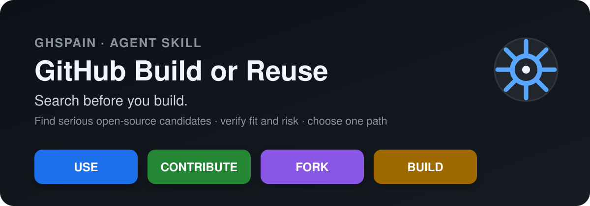
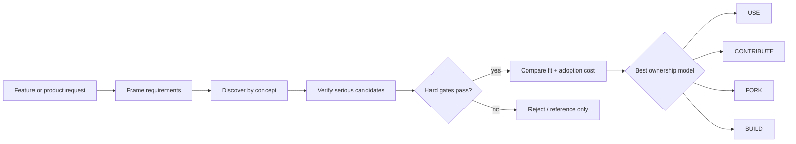

# GitHub Build or Reuse

**Don't reinvent the wheel with AI-generated code. Search GitHub first, vet the best open-source options, then decide whether to USE, CONTRIBUTE, FORK, or BUILD.**

`github-build-or-reuse` is a portable **Agent Skill for GitHub Copilot, Codex, Claude Code, Cursor and other Agent Skills-compatible coding agents**. It turns “has somebody already built this?” into a repeatable engineering gate before substantial implementation.

[](https://github.com/ghspain/github-build-or-reuse/actions/workflows/validate.yml)
[](https://github.com/ghspain/github-build-or-reuse/releases)
[](LICENSE)
[](skills/github-build-or-reuse/SKILL.md)
[](https://skills.sh/ghspain/github-build-or-reuse/github-build-or-reuse)

## In 20 seconds

Before an AI coding agent starts a substantial implementation, the skill:

1. frames the must-haves and hard constraints;
2. searches GitHub and open source by **concept**, not only package name;
3. verifies serious candidates beyond stars and README claims;
4. compares adoption/adaptation effort with greenfield ownership;
5. returns one decision: **USE, CONTRIBUTE, FORK, or BUILD**.


This is a **dated public-repository evidence snapshot**, not a fictional benchmark. The scenario asks for a self-hosted AI presentation generator with editable PPTX, multiple LLM providers and an API. On **2026-09-01**, public GitHub metadata and README evidence for [`presenton/presenton`](https://github.com/presenton/presenton) supported those demo requirements and produced a **USE** verdict.

The evidence source, animated GIF, static SVG fallback and terminal recording are all derived from [`assets/demo.json`](assets/demo.json), so they cannot silently tell different stories.

```bash
# Replay the terminal version
asciinema play assets/demo.cast

# Regenerate / verify the tracked source assets
python scripts/generate_demo.py
python scripts/generate_demo.py --check
```

The `Render README demo` workflow reuses the official [`asciinema/agg`](https://github.com/asciinema/agg) renderer to regenerate `assets/demo.gif` when the evidence source changes. See [`docs/demo.md`](docs/demo.md) for the refresh and rendering process.

## Install

### `npx skills` — easiest cross-agent path

```bash
# Inspect before installing
npx skills@latest add ghspain/github-build-or-reuse --list

# Install into the current project
npx skills@latest add ghspain/github-build-or-reuse --skill github-build-or-reuse

# Example: install globally for Codex
npx skills@latest add ghspain/github-build-or-reuse --skill github-build-or-reuse --agent codex --global
```

### GitHub CLI / GitHub Copilot

GitHub CLI **2.90.0+** can preview, install and update Agent Skills directly from GitHub repositories:

```bash
gh skill preview ghspain/github-build-or-reuse github-build-or-reuse
gh skill install ghspain/github-build-or-reuse github-build-or-reuse

# Reproducible release
gh skill install ghspain/github-build-or-reuse github-build-or-reuse@v1.2.0
```

For long-lived environments, prefer a release tag or `--pin` so upstream changes cannot silently alter behavior.

### ChatGPT / Codex plugin

```bash
codex plugin marketplace add ghspain/github-build-or-reuse --ref v1.2.0
```

Then open `/plugins`, choose the **GitHub Community Spain** marketplace and install **GitHub Build or Reuse**.

<details>
<summary><strong>Other Agent Skills-compatible clients</strong></summary>

The canonical portable skill lives at:

```text
skills/github-build-or-reuse/
```

Copy or install that directory into the skills location supported by your client.

</details>

## Why search before you build?

AI coding agents made greenfield software dramatically cheaper to *start*. They did not make it free to own.

Generated implementations still create maintenance, security, dependency, upgrade, observability, documentation and support obligations. When a mature open-source project already solves most of the problem, generating a parallel implementation can be the most expensive option over the software's lifetime.

The skill exists to make that alternative explicit before momentum turns “just build it” into an architectural decision.

## Four outcomes, not just build vs buy

| Decision | Choose it when |
| --- | --- |
| **USE** | An existing open-source project covers the important requirements and clears the risk gates. |
| **CONTRIBUTE** | A strong upstream exists and the missing capability belongs there. Improve the ecosystem instead of creating a parallel project. |
| **FORK** | The base is strong, but sustained product or architecture divergence is intentional and the license permits it. |
| **BUILD** | No candidate clears the hard gates, adaptation is worse than greenfield, or the differentiating architecture is fundamental. |

Even a `BUILD` verdict should preserve reusable libraries, protocols, schemas and implementation lessons discovered during research.

## What it actually verifies

The default due diligence goes beyond GitHub stars:

- **functional fit** — must-haves, nice-to-haves and important gaps;
- **architecture** — extension points, deployment model, integration surface and platform fit;
- **maintenance** — recent activity, releases, CI, issue/PR health and abandonment signals;
- **security** — security policy, dependency hygiene, auth, auditability and operational evidence when relevant;
- **license and governance** — license compatibility, contribution model and ownership constraints;
- **project health** — maintainer concentration, contribution sustainability and release discipline;
- **adoption cost** — migration, customization, upgrades and long-term fork ownership.

Hard gates override popularity and numeric scoring. Evidence that cannot be verified stays **unknown** instead of being guessed.

## When the skill should trigger

Use it before implementing a non-trivial capability that could plausibly already exist, including:

- authentication, authorization and identity;
- payments and billing;
- web scraping and browser automation;
- notifications, email and messaging;
- search, indexing and RAG infrastructure;
- observability, audit, logging and monitoring;
- GitHub automation, bots and developer tooling;
- media processing, image/video generation or transcription;
- schedulers, queues, rate limiting and workflow engines;
- substantial plugins, libraries, services and new applications.

It also triggers when you explicitly ask for **GitHub alternatives**, **open-source alternatives**, a **repository comparison**, or whether to **adopt, contribute, fork or rebuild** an existing project.

Tiny throwaway scripts and mechanical edits intentionally do not require a full repository due-diligence cycle.

## Example prompts

> Before building this self-hosted service, search GitHub and decide whether we should USE, CONTRIBUTE, FORK, or BUILD.

> Find mature open-source alternatives for this feature. Check license, maintenance, security signals and architecture before recommending one.

> Compare these repositories as the foundation for our product. Include what we would have to maintain ourselves.

> Could we contribute the missing capability upstream instead of maintaining our own fork?

> Prove that greenfield is the better choice before generating the implementation.

## How it works



1. **Frame requirements** — must-haves, stack, deployment, security/compliance, scale, licensing and acceptable adaptation effort.
2. **Discover by concept** — multiple queries, synonyms, topics, adjacent ecosystems and known upstreams.
3. **Verify candidates** — structured GitHub/API/`gh` evidence where possible; broader web research for additional context.
4. **Apply hard gates** — functional, license, security, platform, maintenance and governance constraints.
5. **Compare ownership cost** — reuse/adaptation versus greenfield, including long-term upgrades and operations.
6. **Choose one path** — USE, CONTRIBUTE, FORK or BUILD, with confidence, evidence gaps and the smallest reversible next action.

See the [`decision framework`](skills/github-build-or-reuse/references/decision-framework.md) and [`GitHub evidence playbook`](skills/github-build-or-reuse/references/github-evidence.md).

## Due-diligence depth

| Depth | Best for | Adds |
| --- | --- | --- |
| **Quick** | Low-cost experiments | concept search, license, archive/activity and README-level fit |
| **Standard** | Real adoption decisions | releases, CI/tests, security policy, issues/PRs, architecture and contribution health |
| **Deep** | Strategic dependencies | code/dependency inspection, maintainer concentration, security history, PoCs/benchmarks and migration risk |

## How this differs from “find me a GitHub repo”

Discovery is only the first step. A repository is not a recommendation just because it appears in search results.

**Discovery → Due diligence → Ownership decision**

That distinction matters when the best answer is not “install package X,” but “contribute this missing feature upstream,” “fork because divergence is structural,” or “build because every candidate fails an important gate.”

## Design choices

### No mandatory custom MCP server

The project follows its own rule: **reuse before build**.

The workflow already works with host-provided GitHub connectors/API, existing MCP integrations, authenticated `gh`, or web research. A bespoke GitHub-wrapper MCP would add authentication, maintenance and security surface without a unique capability.

### Tool degradation must be visible

The skill prefers structured GitHub evidence, but it does not pretend unavailable checks succeeded. Missing evidence is reported explicitly; candidate repository content is treated as untrusted input.

## Standards and compatibility

The canonical skill follows the open **Agent Skills** specification. The repository also follows OpenAI plugin packaging conventions (`.codex-plugin/plugin.json` + `skills/`). `AGENTS.md` remains maintainer guidance rather than runtime skill content.

See [`docs/standards-and-roadmap.md`](docs/standards-and-roadmap.md) for the design rationale around Agent Skills, plugins, AGENTS.md, OpenAI Agents SDK definitions and MCP.

## Quality and evals

The skill ships with output evals and trigger queries under [`skills/github-build-or-reuse/evals/`](skills/github-build-or-reuse/evals/). CI validates repository packaging, generated demo consistency, the Agent Skills reference specification, GitHub CLI publishing when available, and discovery by `npx skills`.

```bash
python scripts/validate.py
python scripts/generate_demo.py --check
```

## Project structure

```text
.
├── assets/
│   ├── banner.svg
│   ├── demo.json       # auditable evidence source
│   ├── demo.svg        # deterministic static rendering
│   ├── demo.cast       # deterministic asciinema recording
│   └── demo.gif        # generated by the render workflow
├── .agents/plugins/marketplace.json
├── .codex-plugin/plugin.json
├── .github/workflows/
│   ├── render-demo.yml
│   └── validate.yml
├── docs/
│   └── demo.md
├── scripts/
│   ├── generate_demo.py
│   └── validate.py
├── skills/github-build-or-reuse/
├── AGENTS.md
├── CHANGELOG.md
├── CONTRIBUTING.md
├── GOVERNANCE.md
├── SECURITY.md
└── README.md
```

## Inspiration and related work

This project was initially prompted in part by [`polmarza/github-repo-scout`](https://github.com/polmarza/github-repo-scout), an MIT-licensed skill centered on concept-level GitHub discovery, license filtering and repository freshness.

We also recommend looking at [`Emanuelel/dont-reinvent`](https://github.com/Emanuelel/dont-reinvent), which frames the problem as **Open Source / Build / Buy** and does an excellent job of making the cost of unnecessary greenfield generation immediately visible. `github-build-or-reuse` takes a different path: it focuses more deeply on GitHub/open-source adoption strategy and makes **CONTRIBUTE** and **FORK** first-class outcomes alongside USE and BUILD.

The implementations are independent. Related projects are useful precisely because this repository's philosophy is to learn from existing work rather than pretend it does not exist.

## Search keywords

Agent Skills · GitHub Copilot skill · Codex skill · Claude Code skill · open-source alternatives · GitHub repository search · software reuse · build vs buy · build vs open source · don't reinvent the wheel · repository due diligence · open-source due diligence · GitHub automation · AI coding agents · software architecture · reuse before build.

## Contributing

Issues and pull requests are welcome, especially examples where the skill made the wrong reuse/build decision. See [`CONTRIBUTING.md`](CONTRIBUTING.md), [`GOVERNANCE.md`](GOVERNANCE.md) and [`AGENTS.md`](AGENTS.md).

## License

MIT © 2026 GitHub Community Spain.
